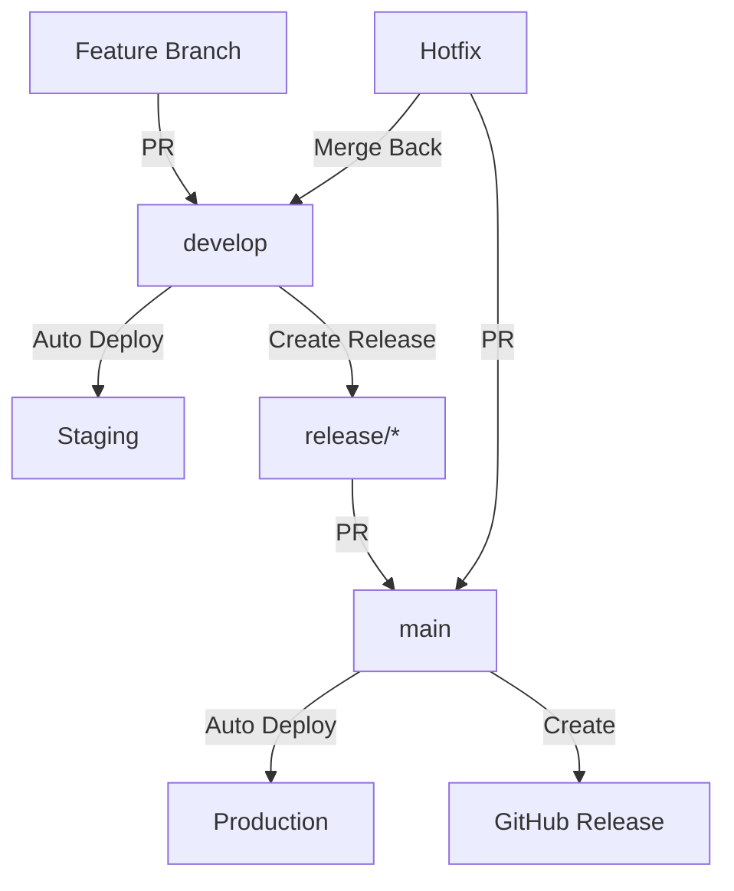

# CI/CD Pipeline Documentation

## Overview

This project uses GitHub Actions for continuous integration and deployment with GitFlow workflow.

## 🔄 Workflows

### 1. Pull Request Checks

**File:** `.github/workflows/pr-checks.yml`

**Triggers:** Pull requests to `main`, `develop`, `release/**`

**Jobs:**

- 🔍 **Lint**: ESLint and Prettier checks
- 🧪 **Test**: Unit and integration tests with PostgreSQL
- 🏗️ **Build**: Application build verification
- 🔒 **Security**: npm audit and Trivy scanning

**Status:** Required for merge

---

### 2. Staging Deployment

**File:** `.github/workflows/deploy-staging.yml`

**Triggers:** Push to `develop`

**Jobs:**

1. **Test**: Run full test suite
2. **Build & Push**: Build Docker image, push to registry
3. **Deploy**: Deploy to staging environment
4. **Smoke Tests**: Verify deployment

**Environment:** `staging`

**Image Tags:**

- `ghcr.io/repo:develop`
- `ghcr.io/repo:staging-{sha}`

---

### 3. Production Deployment

**File:** `.github/workflows/deploy-production.yml`

**Triggers:** Push to `main`

**Jobs:**

1. **Test**: Run full test suite
2. **Build & Push**: Build production image with version tags
3. **Deploy**: Deploy to production
4. **Release**: Create GitHub release with changelog

**Environment:** `production`

**Image Tags:**

- `ghcr.io/repo:latest`
- `ghcr.io/repo:v{version}`
- `ghcr.io/repo:prod-{sha}`

---

### 4. Release Preparation

**File:** `.github/workflows/release.yml`

**Triggers:** Push to `release/**`

**Jobs:**

1. **Validate**: Run all checks
2. **Build RC**: Build release candidate image
3. **Verify**: Check version and changelog

**Image Tags:**

- `ghcr.io/repo:rc-{version}`
- `ghcr.io/repo:rc-latest`

---

## 🔐 Required Secrets

Configure these in GitHub Settings → Secrets and variables → Actions:

### Repository Secrets

```
GITHUB_TOKEN              # Auto-provided by GitHub
```

### Environment Secrets (staging)

```
STAGING_DATABASE_URL      # Staging database connection
STAGING_JWT_ACCESS_SECRET # Staging JWT access secret
STAGING_JWT_REFRESH_SECRET # Staging JWT refresh secret
STAGING_CORS_ORIGIN       # Staging CORS origins
```

### Environment Secrets (production)

```
PROD_DATABASE_URL         # Production database connection
PROD_JWT_ACCESS_SECRET    # Production JWT access secret
PROD_JWT_REFRESH_SECRET   # Production JWT refresh secret
PROD_CORS_ORIGIN          # Production CORS origins
```

---

## 🌍 Environments

### Staging

- **Branch:** `develop`
- **URL:** https://staging.yourdomain.com
- **Protection:** None (auto-deploy)
- **Purpose:** Integration testing

### Production

- **Branch:** `main`
- **URL:** https://yourdomain.com
- **Protection:** Required reviewers
- **Purpose:** Live application

---

## 📊 Workflow Diagram



---

## 🚀 Deployment Process

### Staging (Automatic)

```bash
# 1. Merge PR to develop
# 2. GitHub Actions automatically:
#    - Runs tests
#    - Builds Docker image
#    - Pushes to registry
#    - Deploys to staging
#    - Runs smoke tests
```

### Production (Automatic)

```bash
# 1. Create release branch
git checkout -b release/1.0.0 develop
npm version 1.0.0 --no-git-tag-version
# Update CHANGELOG.md
git commit -am "chore: prepare release 1.0.0"
git push origin release/1.0.0

# 2. Create PR to main
# 3. After approval and merge, GitHub Actions:
#    - Runs all tests
#    - Builds production image
#    - Deploys to production
#    - Creates GitHub release
#    - Tags version
```

---

## 🔧 Local Testing of Workflows

### Using Act

```bash
# Install act
brew install act

# Test PR checks
act pull_request -W .github/workflows/pr-checks.yml

# Test with secrets
act -s GITHUB_TOKEN=your-token
```

---

## 📈 Monitoring

### GitHub Actions

- View workflow runs: Actions tab
- Check logs for failures
- Review deployment status

### Deployment Status

- Staging: Check staging environment health
- Production: Monitor production metrics

---

## 🐛 Troubleshooting

### Workflow Fails on Tests

```bash
# Run tests locally first
npm run test

# Check database connection
# Verify environment variables
```

### Docker Build Fails

```bash
# Test build locally
docker build -f Dockerfile.prod -t test .

# Check Dockerfile syntax
# Verify all files exist
```

### Deployment Fails

```bash
# Check deployment logs in Actions
# Verify secrets are configured
# Check target environment health
```

---

## 🎯 Best Practices

1. **Always run tests locally** before pushing
2. **Keep PRs small** and focused
3. **Write meaningful commit messages**
4. **Update CHANGELOG.md** for releases
5. **Monitor deployment** after merge
6. **Rollback quickly** if issues arise

---

## 📚 Resources

- [GitHub Actions Docs](https://docs.github.com/en/actions)
- [GitFlow Workflow](https://www.atlassian.com/git/tutorials/comparing-workflows/gitflow-workflow)
- [Semantic Versioning](https://semver.org/)
- [Keep a Changelog](https://keepachangelog.com/)
